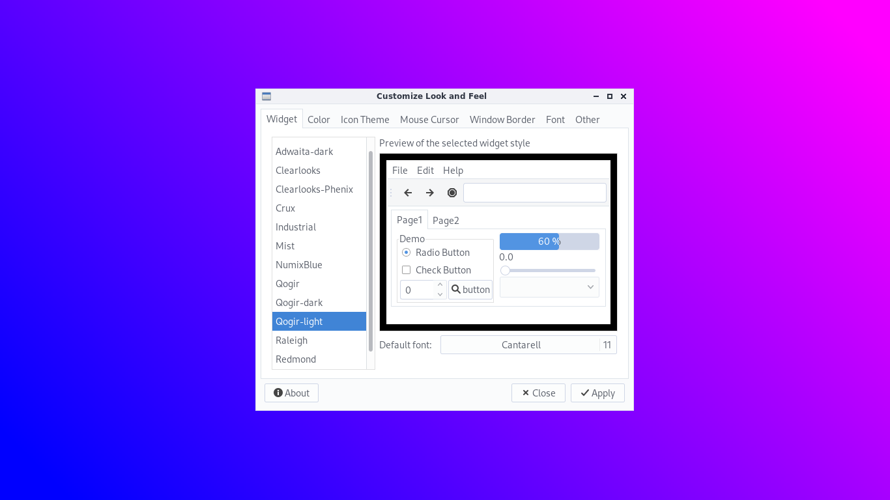
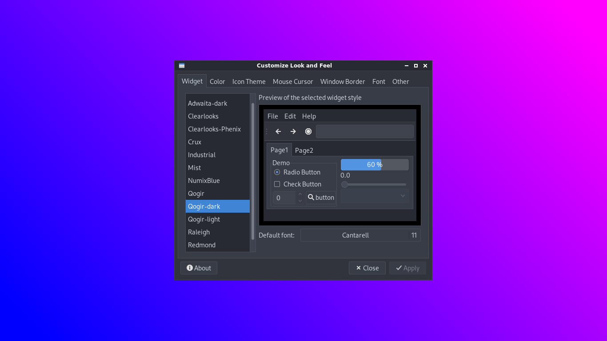

# Qogir theme openbox

This is a clone of [Numix] GTK with color edited to use with [Qogir] theme

## Install

Copy theme folder to ~/.themes or /usr/share/themes

## Screenshots

[Numix]: https://github.com/numixproject/numix-gtk-theme
[Qogir]: https://github.com/vinceliuice/Qogir-theme
